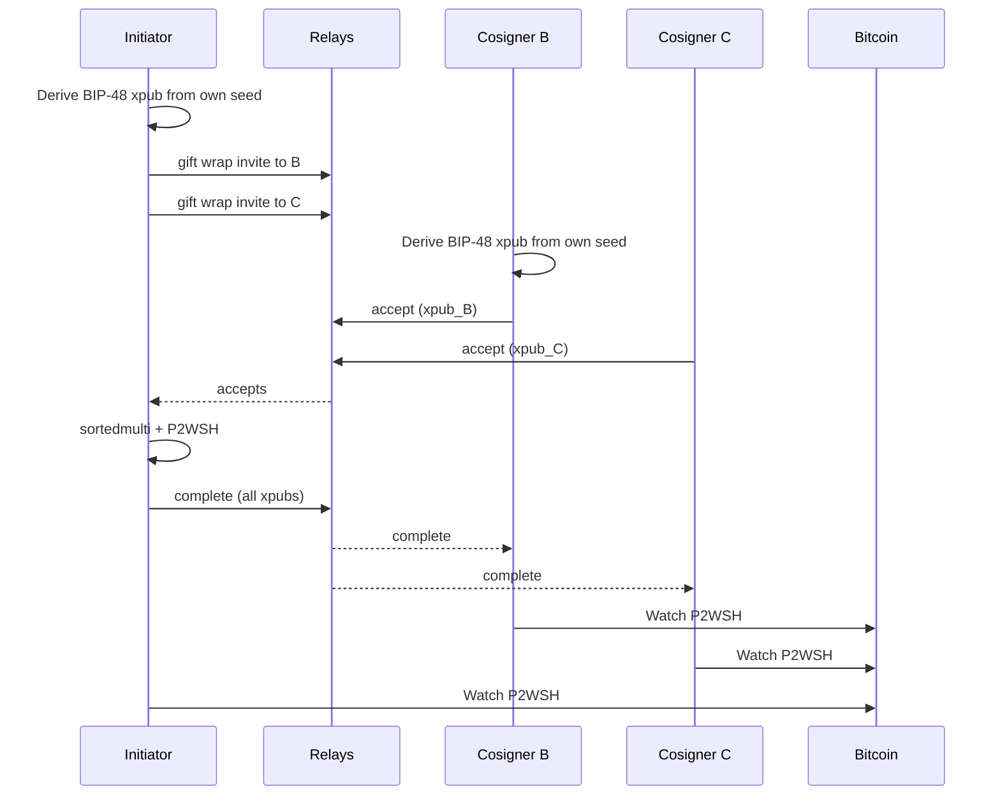

# Nostr multisig coordination

A **coordination layer** for Bitcoin P2WSH multisig: encrypted Nostr messages carry invites, cosigner xpubs, and PSBTs so users never have to air-gap QR codes or paste xpubs in chat.

Invented by **David Coen**. First implementation: Edge React GUI ([edge-bitcoin-multisig](https://github.com/theDavidCoen/edge-bitcoin-multisig)). This repository specifies the **wire protocol and UX model**, not a particular wallet binary.

Bitcoin remains the settlement layer. Nostr never holds funds, never sees seeds, and never replaces BIP-48/P2WSH.

---

## Why a coordination layer

Creating an m-of-n wallet today is a **ceremony**:

1. Each signer exports an xpub (or a whole descriptor).
2. Someone concatenates keys, builds a script, sends the descriptor back.
3. Every device must import the same script or they will watch different addresses.
4. Spending repeats the ceremony with a PSBT.

That is hostile UX. It also invites **unsafe shortcuts**: screenshotting xpubs, sending them in messengers, or pasting keys from apps whose RNGs were weak (see the **Coincard** case — low entropy keys that still look like valid xpubs).

This protocol treats coordination as **private messages between the people who already intend to share a script**:

| Layer | Job |
|-------|-----|
| **Nostr (NIP-17 gift wrap)** | Discover the other Edge (or compatible) identities, send encrypted invites, collect xpubs, circulate PSBTs |
| **Bitcoin (P2WSH)** | Hold the coins. Descriptor, BIP-67, BIP-48 account keys |

Users see “invite Alice” and “slide to join”, not a workshop on output descriptors. Power users can still export BIP-380 / BIP-129 for Sparrow and friends.

---

## Design goals

1. **No coordinator server.** Any NIP-17-capable client plus public relays is enough. There is no Edge backend for multisig.
2. **Improved UX, not a new custody model.** Each signer still controls their own BIP-39 seed. The protocol only moves **public** account keys and **partially signed** transactions.
3. **Identity ≠ money.** The Nostr `npub` is a routing address. On-chain keys are BIP-48 `m/48'/0'/0'/2'` (or a documented legacy path). Compromise of nsec does not spend the P2WSH; compromise of the Bitcoin seed does.
4. **NIP-05 is a human alias.** `alice@example.com` resolves over HTTPS to an npub. The wire format always uses npub. Relays are not used to resolve NIP-05 (NIP-05 is `.well-known/nostr.json`).

---

## Threat model (short)

**Assumed**

- Relays are honest-but-curious and may log ciphertext, timestamps, and `p` tags.
- Gift wraps use ephemeral wrap keys (NIP-59 / NIP-17). Recipients decrypt with their nsec.
- Bitcoin seeds never leave the device; they are not in Nostr payloads.

**Out of scope / not solved by this layer**

- A malicious relay cannot decrypt NIP-44 content without the recipient nsec, but **traffic analysis** (who talks to whom) is possible.
- If a user pastes their nsec, an attacker can impersonate them in the ceremony (invite/accept/PSBT) but still cannot sign P2WSH without the Bitcoin key.
- This is not a threshold-signature (FROST/MuSig2) protocol. It is classic script multisig plus encrypted mail.

---

## Transport

Each application JSON in [`types/`](./types/) is the **rumor `content`** (kind **14**). Clients wrap it:

1. Kind **13** seal (NIP-44, sender nsec → recipient pubkey)
2. Kind **1059** gift wrap (ephemeral key, tag `["p", recipientHex]`)

Publish to several relays. Subscribe to kind 1059 for your pubkey. Deduplicate by event id.

Suggested public relays (Edge prototype): `wss://relay.damus.io`, `wss://nos.lol`, `wss://relay.primal.net`. Any NIP-17 relay set is fine if all participants share at least one.

If publish fails, clients SHOULD queue ciphertext locally and retry (Edge: `pendingNostrOutbox`).

---

## Identifiers

| Field | Meaning |
|-------|---------|
| `proposalId` | Opaque id for one **wallet ceremony** (create/join). Not a Bitcoin txid. |
| `spendId` | Opaque id for one **spend ceremony** (one PSBT). |
| `initiatorNpub` | Who started the wallet or the spend. |
| `initiatorXpub` / `xpub` | BIP-32 **account** xpub (canonical `xpub` version bytes). For native P2WSH this SHOULD be `m/48'/0'/0'/2'` (depth 4, index `2'`). |

Clients MUST verify BIP-32 **depth and child index** of an xpub. A descriptor origin `[fp/48'/0'/0'/2']` is not proof; the origin string can lie.

---

## Message types

Wire payloads live in [`types/`](./types/). One file per `type` string; `version` is `1` for all of them.

**Wallet creation:** [`invite`](./types/edge-multisig-invite.md), [`accept`](./types/edge-multisig-accept.md), [`complete`](./types/edge-multisig-complete.md)

**Spend:** [`request`](./types/edge-multisig-spend-request.md), [`partial`](./types/edge-multisig-spend-partial.md), [`reject`](./types/edge-multisig-spend-reject.md), [`complete`](./types/edge-multisig-spend-complete.md)

---

## Creation flow

**UX mapping (Edge):** notification “Waiting for you to join” → pending scene → slider. Initiator sees cosigner rows until the script is ready. No QR round-trip.

---

## What never goes on Nostr

- BIP-39 mnemonic / `bitcoinKey`
- BIP-32 xprv / yprv / zprv
- Nostr `nsec` (except the sender using it locally to wrap)
- Account passwords

NIP-05 identifiers are **not** required on the wire. Resolve to npub first.

---

## Compatibility

A second wallet can interoperate if it:

1. Uses the same `type` strings and JSON fields ([`types/`](./types/); cleaners in Edge: `src/util/multisig/types.ts`).
2. Gift-wraps with NIP-17.
3. Derives native P2WSH from the collected xpubs with BIP-67 and the same derivation path.
4. Refuses to treat a depth-3 xpub as BIP-48 just because a descriptor origin says `48'`.

Descriptor **export/import** (BIP-380 / BSMS) is the fallback when the other signer has no Nostr stack.

---

## Reference implementation

Edge GUI (`theDavidCoen/edge-react-gui`, branch `multisig`):

- Wrap/unwrap: `src/util/nostr/nip17.ts`
- Publish/subscribe: `src/util/nostr/relayPool.ts`
- Messages: `src/actions/MultisigActions.ts`
- Implementation notes for Edge staff: [edge-bitcoin-multisig](https://github.com/theDavidCoen/edge-bitcoin-multisig)
